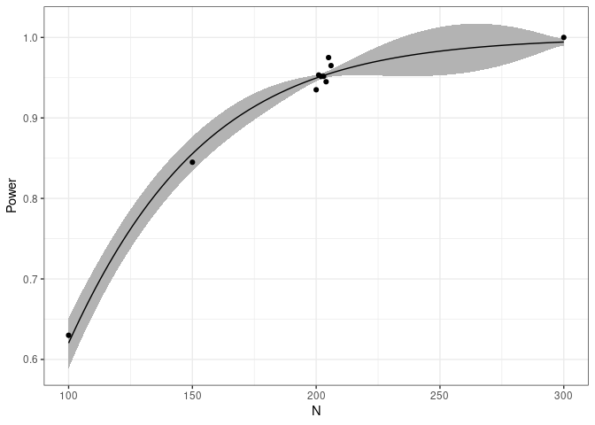

<!-- README.md is generated from README.Rmd. Please edit that file -->

# mlpwr

<!-- badges: start -->

[](https://github.com/flxzimmer/mlpwr/actions/workflows/R-CMD-check.yaml)
<!-- badges: end -->

We implement a surrogate modeling algorithm to guide simulation-based
sample size planning. The method is described in detail in a recent
paper (Zimmer & Debelak, 2023, <https://doi.org/10.1037/met0000611>). It
supports multiple study design parameters and optimization with respect
to a cost function. It can find optimal designs that correspond to a
desired statistical power or that fulfill a cost constraint.

Below is a toy example of how to use the package. More in-depth
resources are:

- A tutorial paper for this package (Zimmer et al., 2023,
  <https://doi.org/10.3758/s13428-023-02269-0>)
- Basic walkthroughs are available in separate vignettes for ANOVA, GLM,
  IRT, multilevel model, and t-test. They can be accessed
  [here](https://github.com/flxzimmer/mlpwr/tree/master/vignettes/).

## Installation

You can install the CRAN version using:

``` r
install.packages("mlpwr")
```

Or, you can install the development version of mlpwr from
[GitHub](https://github.com/) with:

``` r
# install.packages("devtools")
devtools::install_github("flxzimmer/mlpwr")
```

## Toy Example

This is a basic demonstration to the mlpwr package by going through a
toy example. We want to obtain the sample size necessary for a mean
comparison using an one-sample t-test.

The package can be loaded via

``` r
library(mlpwr)
```

### Setting up a simulation function (simfun)

A simulation function (simfun) is a function to generate artificial data
and subsequently perform an hypothesis test.

A simple function simulates a group mean comparison with a t-test. The
input is a sample size n and the output is either TRUE or FALSE
depending on the significance of the hypothesis test.

``` r
simfun_ttest <- function(N) {
    # Generate a data set
    dat <- rnorm(n = N, mean = 0.3)
    # Test the hypothesis
    res <- t.test(dat)
    res$p.value < 0.01
}
```

We can test the data generating function as follows for the sample sizes
30 and 400.

``` r
simfun_ttest(30)
#> [1] FALSE
simfun_ttest(400)
#> [1] TRUE
```

### Performing the search for design parameters

The find.design functions can be used to find an appropriate sample size
given a power level that should be surpassed.

The central arguments to be specified are the following:

- simfun: The data generating function as defined above.

- boundaries: The lower and upper bound to search within, e.g. a sample
  size between 50 and 200.

- power: The desired power of the design.

- evaluations: The number of evaluations of the simfun

Once a termination criterion is met (e.g. the number of permissible
simfun evaluation specified with evaluations), the algorithm is
terminated.

We can perform the search with the above arguments in use.

``` r
ds <- find.design(simfun = simfun_ttest, boundaries = c(100,
    300), power = 0.95, evaluations = 4000)
#>  Updates: 1, Evaluations: 1000, Time: 0.1 Updates: 2, Evaluations: 1200, Time: 0.2 Updates: 3, Evaluations: 1400, Time: 0.2 Updates: 4, Evaluations: 1600, Time: 0.3 Updates: 5, Evaluations: 1800, Time: 0.3 Updates: 6, Evaluations: 2000, Time: 0.3 Updates: 7, Evaluations: 2200, Time: 0.4 Updates: 8, Evaluations: 2400, Time: 0.4 Updates: 9, Evaluations: 2600, Time: 0.5 Updates: 10, Evaluations: 2800, Time: 0.5 Updates: 11, Evaluations: 3000, Time: 0.6 Updates: 12, Evaluations: 3200, Time: 0.6 Updates: 13, Evaluations: 3400, Time: 0.6 Updates: 14, Evaluations: 3600, Time: 0.7 Updates: 15, Evaluations: 3800, Time: 0.7 Updates: 16, Evaluations: 4000, Time: 0.8
```

While it is running, the function gives us some updates regarding the
number of updates performed, the time used, and the number of
evaluations.

We can get an overview of the results via summary.

``` r
summary(ds)
#> 
#> Call:
#> find.design(simfun = simfun_ttest, boundaries = c(100, 300), 
#>     power = 0.95, evaluations = 4000)
#> 
#> Design: N = 201
#> 
#> Power: 0.95064,  SE: 0.00379
#> Evaluations: 4000,  Time: 0.86,  Updates: 16
#> Surrogate: Logistic regression
```

The results indicate that a sample size of 201 is suitable. It shows the
predicted power for this sample size, as well as an estimate of its
uncertainty (SE). The summary additionally reports the number of
simulation function evaluations, the time until termination, and the
number of surrogate model updates. The details of the surrogate modeling
algorithm are described in our
[paper](https://doi.org/10.1037/met0000611).

Also, we can plot the fitted relationship between sample size and power.
The black dots show us the simulated data. The gray ribbon indicates the
uncertainty of the power at the respective sample sizes.

``` r
plot(ds)
```



## Simulation Function Templates

Some templates for simulation functions can be found in the
`simulation_functions` vignette. It can be accessed at
<https://github.com/flxzimmer/mlpwr/blob/master/vignettes/simulation_functions.Rmd>.
